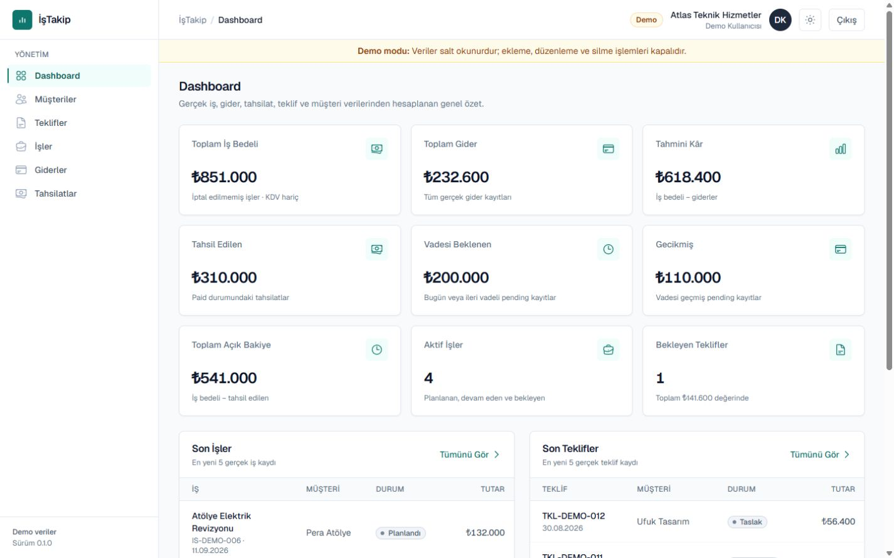
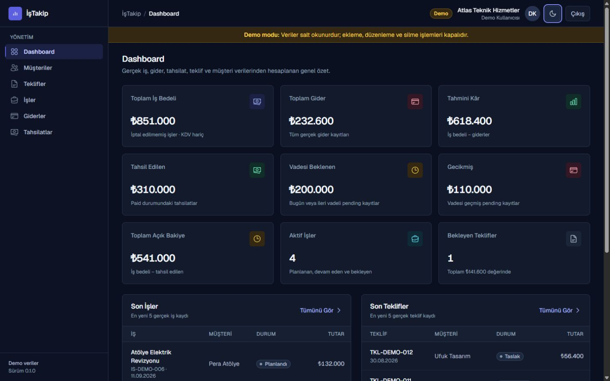
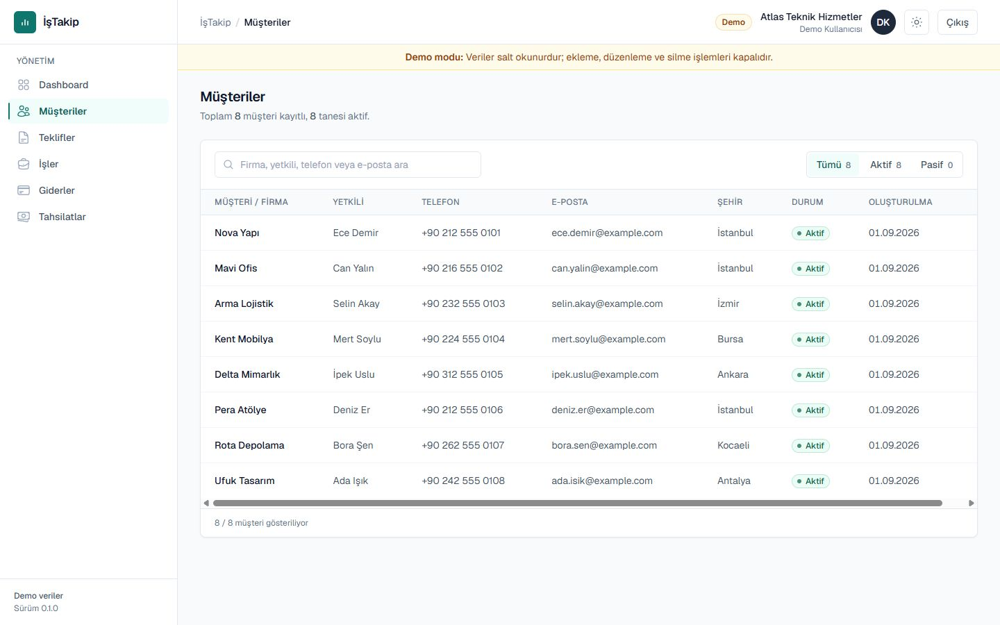
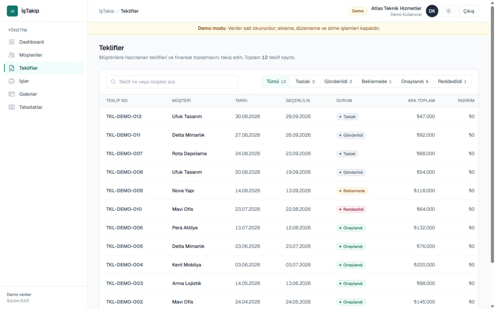
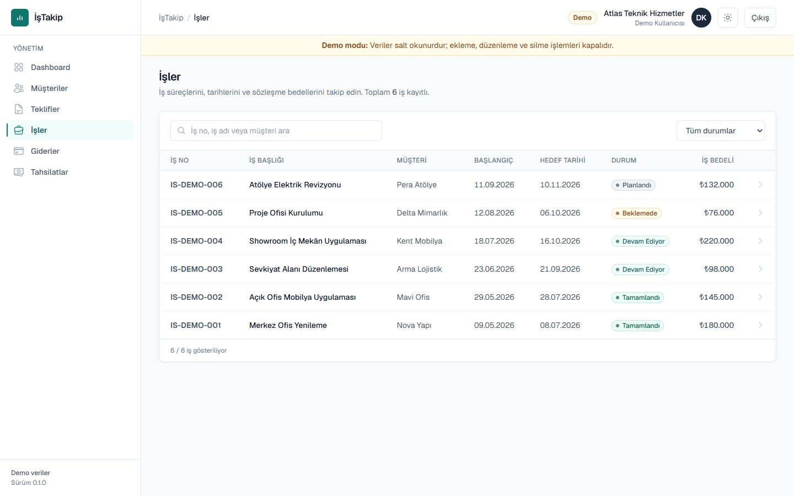
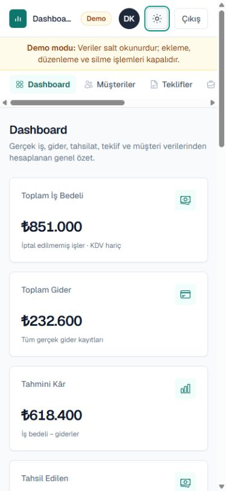

# İşTakip

Türkiye'deki küçük işletmeler için müşteri, teklif, iş, gider ve tahsilat süreçlerini tek panelden yönetmeye yönelik full-stack SaaS uygulaması.

İşTakip; operasyonel kayıtları birbirinden kopuk tablolar ve araçlar yerine, şirket bazında izole edilen tek bir iş akışında birleştirir. Uygulama Next.js App Router üzerinde çalışır; kimlik doğrulama, ilişkisel veri modeli ve yetkilendirme katmanı Supabase tarafından sağlanır.

## Ekran Görüntüleri

### Dashboard — Light



| Dashboard — Dark | Müşteriler |
| --- | --- |
|  |  |

| Teklifler | İşler |
| --- | --- |
|  |  |

### Responsive görünüm



## Özellikler

- Supabase Auth tabanlı kayıt, giriş ve oturum yönetimi
- E-posta doğrulama akışı
- Yeni şirket ve kullanıcı profili onboarding süreci
- Şirket bazında müşteri yönetimi
- Teklif ve teklif kalemleri yönetimi
- Onaylanan teklifin tek seferlik iş kaydına dönüştürülmesi
- İş bazlı gider takibi
- Vadeli tahsilat, ödeme yöntemi ve tahsil edildi takibi
- İş, gider, tahsilat ve teklif verilerinden hesaplanan dashboard
- Light ve dark tema
- Veritabanı seviyesinde korunan read-only portföy demo modu
- Desktop ve mobile uyumlu responsive arayüz

## Teknolojiler

| Katman | Teknoloji |
| --- | --- |
| Web framework | Next.js 16, App Router |
| UI | React 19, TypeScript 5, Tailwind CSS 4 |
| Backend erişimi | Next.js Server Actions, Supabase SSR |
| Veritabanı | PostgreSQL, Supabase |
| Kimlik doğrulama | Supabase Auth |
| Kod kalitesi | ESLint 9 |
| Versiyon kontrolü | Git, GitHub |

## Uygulama Akışı

```text
Müşteri
  → Teklif + Teklif Kalemleri
    → Onaylanan Teklif
      → İş
        → Gider / Tahsilat
          → Dashboard
```

Müşteriye hazırlanan teklif kalemleriyle birlikte kaydedilir. Onaylanan teklif bir iş kaydına dönüştürülür; giderler ve tahsilatlar bu iş üzerinden takip edilir. Dashboard, modüllerdeki gerçek verilerden finansal ve operasyonel özetleri üretir.

## Güvenlik

- Row Level Security (RLS) ile tablo seviyesinde yetkilendirme
- `company_id` ve oturum profili üzerinden multi-tenant şirket izolasyonu
- `SECURITY DEFINER` RPC'lerde kapalı varsayılan yetkiler ve yalnız gerekli rollere dar `EXECUTE` izinleri
- Server Action katmanında tip, UUID, tarih, tutar ve alan uzunluğu doğrulamaları
- Trigger, constraint ve kontrollü RPC'lerle database-level business rules
- Nonce tabanlı Content Security Policy ve ek HTTP security headers
- Public istemci yapılandırması ile sunucu sırlarının env seviyesinde ayrılması
- Demo şirkette UI kontrollerine ek olarak RLS, trigger ve RPC seviyesinde mutation engeli
- Haftalık npm dependency kontrolleri için Dependabot yapılandırması

Bu önlemler uygulamanın saldırı yüzeyini azaltır; güvenlik kontrollerinin production ortamında düzenli olarak gözden geçirilmesi gerekir.

## Database / Business Rules

- Teklif numaraları şirket ve yıl kapsamında üretilir; sayaç tablosundaki atomik `ON CONFLICT ... DO UPDATE` işlemi eşzamanlı isteklerde benzersiz sıra sağlar.
- İş numaraları şirket ve yıl kapsamında aynı concurrency-safe sayaç yaklaşımıyla üretilir.
- Teklif ve teklif kalemleri tek bir atomik PostgreSQL RPC işlemi içinde oluşturulur veya güncellenir.
- Onaylanan teklifler ve bunlara bağlı kalemler trigger seviyesinde immutable hale gelir.
- Bir onaylı teklif yalnızca bir kez iş kaydına dönüştürülebilir.
- İş sözleşme bedeli, dönüşüm anında teklif kalemlerinden hesaplanan historical snapshot olarak saklanır.
- Gider kayıtları tenant doğrulaması yapılan bir iş kaydına bağlıdır.
- Bir işe ayrılan tahsilatların toplamı işin sözleşme bedelini aşamaz; kontrol parent row lock ile eşzamanlı isteklere karşı korunur.
- `overdue` veritabanında kalıcı bir durum değildir; `pending` tahsilatın `due_date` değeri üzerinden uygulama katmanında türetilir.

## Demo Mode

Portföy demosu, kurgusal veriler içeren ayrı bir demo şirketinde çalışır. Demo oturumunda ekleme, düzenleme, silme, teklif-iş dönüşümü ve ödeme güncelleme kontrolleri arayüzden kaldırılır; aynı işlemler veritabanı seviyesinde de reddedilir.

Demo kimlik bilgileri kaynak koda veya README'ye yazılmaz ve yalnızca sunucu ortamında tutulur.

> Canlı demo yakında eklenecektir.

## Kurulum

### 1. Projeyi klonlayın

```bash
git clone https://github.com/ahmetcanayyildiz/istakip.git
cd istakip
npm install
```

### 2. Ortam değişkenlerini hazırlayın

`.env.example` dosyasını `.env.local` olarak kopyalayın ve aşağıdaki gerekli değerleri kendi Supabase projenizden doldurun:

```dotenv
NEXT_PUBLIC_SUPABASE_URL=
NEXT_PUBLIC_SUPABASE_PUBLISHABLE_KEY=
```

Read-only demo akışına ait isteğe bağlı sunucu değişkenleri `.env.example` içinde ayrıca belgelenmiştir. Gerçek anahtarları veya kimlik bilgilerini repoya eklemeyin.

### 3. Supabase migration'larını uygulayın

Supabase CLI ile oturum açıp projeyi bağladıktan sonra repository içindeki migration'ları uygulayın:

```bash
npx supabase login
npx supabase link --project-ref <project-ref>
npx supabase db push
```

### 4. Geliştirme sunucusunu başlatın

```bash
npm run dev
```

Uygulama varsayılan olarak [http://localhost:3000](http://localhost:3000) adresinde açılır.

## Proje Durumu

MVP tamamlandı. Aşağıdaki ana modüller uygulama içi statik mock dizileri yerine gerçek Supabase tabloları ve RPC'leriyle çalışır:

- Customers
- Quotes ve quote items
- Jobs
- Expenses
- Collections
- Dashboard

Portföy demo modu ise gerçek kullanıcı verilerinden ayrılmış, özellikle bu amaçla hazırlanmış kurgusal seed verisini kullanır.

## Geliştirme Notları

Sonraki geliştirme adımları kontrollü biçimde şu alanlara odaklanabilir:

- Büyük veri setleri için server-side pagination
- Account deletion ve veri retention politikası
- Production deployment ve operasyonel izleme
- Kayıt/giriş uçları için isteğe bağlı CAPTCHA ve abuse protection
